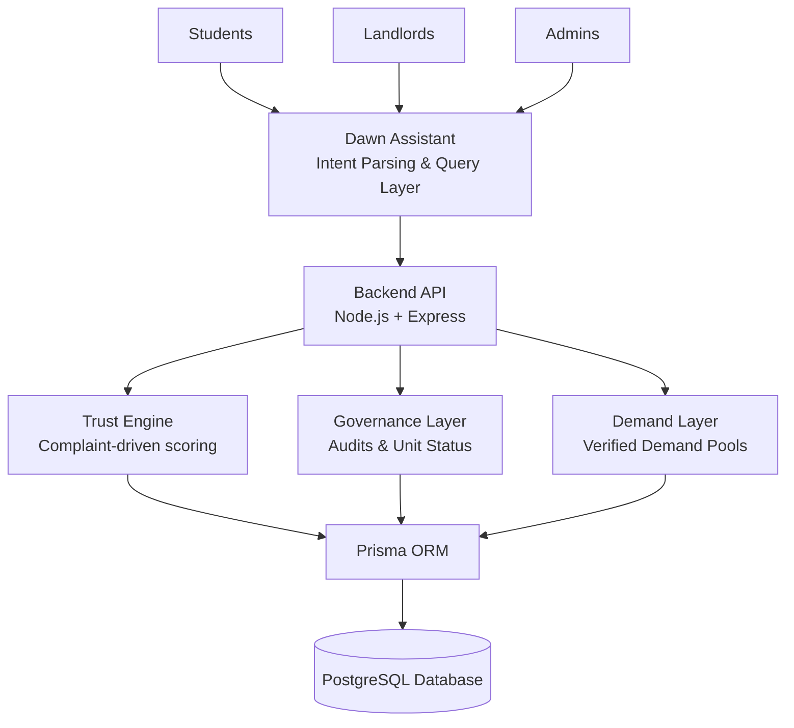

# NearNest System Architecture

NearNest is a corridor-based student housing governance platform built to make housing discovery safer, more transparent, and more accountable. Instead of treating housing like a simple marketplace, NearNest structures access through verified demand, calculates trust from real behavioral signals, and uses governance workflows to enforce quality. Dawn acts as a conversational interface on top of the system, helping users query and act through natural language without bypassing platform rules.

## Architecture Diagram

```text
Students / Landlords / Admins
            │
            ▼
      Dawn Assistant
 (Conversational Query Layer)
            │
            ▼
  Backend API (Node.js + Express)
            │
   ├── Trust Engine
   ├── Governance Layer
   └── Demand System (VDP)
            │
            ▼
         Prisma ORM
            │
            ▼
   PostgreSQL Database
```

## System Architecture Diagram



* Dawn acts as a conversational interface translating natural queries into deterministic API calls.
* The backend enforces trust through complaint-driven scoring and governance rules.
* Verified Demand Pools structure housing demand by corridor and institution.
* The database layer stores behavioral history including complaints, trust scores, occupancy records, and audit logs.

## Core Components

### 1. Dawn Assistant

Dawn is a deterministic conversational layer that converts user intent into existing API actions. It helps students, landlords, and admins interact with the system through natural language, but it does not directly access the database and does not override governance, validation, or access-control rules.

### 2. Backend API

The backend is built with Node.js and Express. It handles authentication, role-based access control, complaint workflows, unit discovery, profile access, occupancy actions, and administrative governance operations. All business rules flow through this layer so the system remains consistent across UI and Dawn-driven actions.

### 3. Trust Engine

Trust scores are calculated from behavioral signals such as complaint severity, repeated incidents, SLA breaches, and unresolved issues. The score is system-generated rather than manually assigned. Units that fall below the visibility threshold are hidden from student discovery, making trust an enforceable platform rule instead of a cosmetic badge.

### 4. Governance Layer

The governance layer gives admins operational control over quality and safety. Admins can review unit submissions, trigger audits, suspend unsafe listings, and enforce structural or operational compliance requirements. This ensures that housing access is governed through measurable checks rather than landlord self-claims alone.

### 5. Demand Layer (VDP)

Verified Demand Pools (VDP) control who can access corridor housing. Only verified students tied to the relevant institution or corridor context are allowed to discover eligible units. This creates structured demand and prevents unrestricted listing visibility.

### 6. Occupancy and Privacy

NearNest uses an occupant ID system that encodes corridor, building, room, and slot information. This allows complaint tracking and occupancy-linked issue reporting without exposing student identities publicly. The design supports operational traceability while preserving user privacy.

### 7. Media Evidence Layer

Unit photos, documents, and walkthrough media are uploaded as part of the listing and review workflow. After submission, evidence can be locked so it cannot be silently changed, helping preserve the integrity of compliance and governance records.

## Technology Stack

Backend:

* Node.js
* Express.js
* Prisma ORM
* PostgreSQL

Frontend:

* Next.js 14
* React
* Tailwind CSS

Infrastructure:

* Local development environment with environment variables
* GitHub CI tests

## Development Workflow

NearNest follows a layered branch workflow:

* `team-dev` -> contributor development
* `dev` -> integration branch
* `main` -> stable demo branch

Protected branches help enforce controlled merges, reduce accidental instability, and keep the demo environment reliable for reviews and presentations.

NearNest enforces trust through visibility, structured demand, and transparent governance rather than marketplace incentives.
