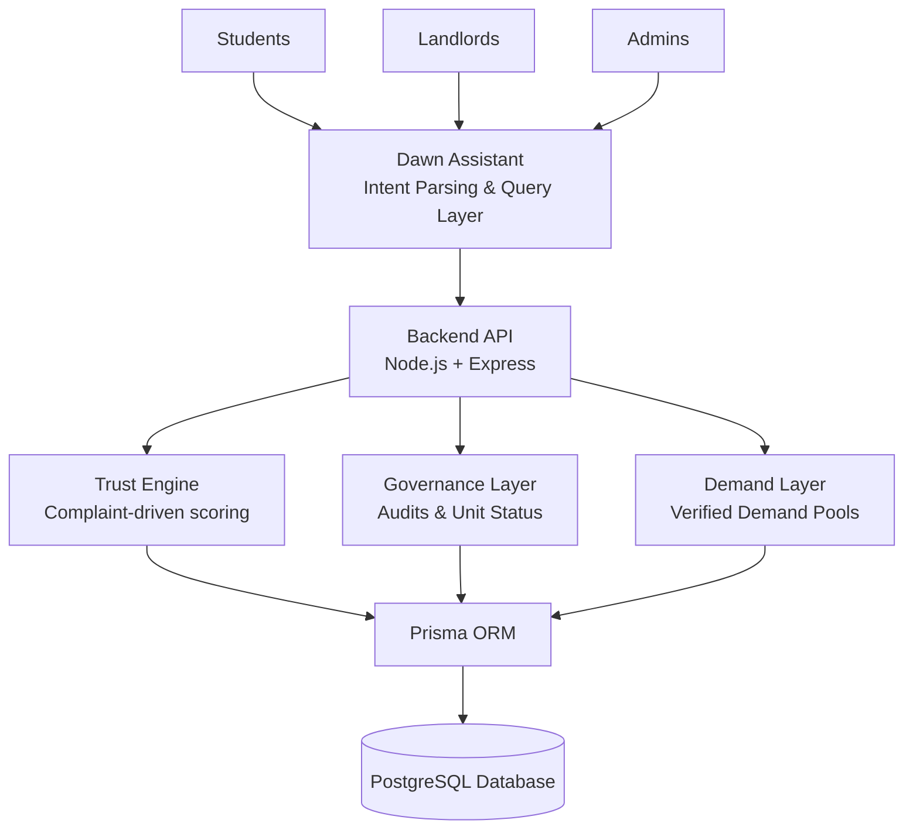

# NearNest System Architecture

NearNest is a corridor-based student housing governance platform built to make housing discovery safer, more transparent, and more accountable. Instead of treating housing like a simple marketplace, NearNest structures access through verified demand, calculates trust from real behavioral signals, and uses governance workflows to enforce quality. Dawn acts as a conversational interface on top of the system, helping users query and act through natural language without bypassing platform rules.

## Architecture Diagram

```text
Students / Landlords / Admins
            │
            ▼
      Dawn Assistant
 (Conversational Query Layer)
            │
            ▼
  Backend API (Node.js + Express)
            │
   ├── Trust Engine
   ├── Governance Layer
   └── Demand System (VDP)
            │
            ▼
         Prisma ORM
            │
            ▼
   PostgreSQL Database
```

## System Architecture Diagram


```mermaid
flowchart TD

Students[Students]
Landlords[Landlords]
Admins[Admins]

Dawn[Dawn Assistant\nIntent Parsing & Query Layer]

API[Backend API\nNode.js + Express]

Trust[Trust Engine\nComplaint-driven scoring]
Governance[Governance Layer\nAudits & Unit Status]
Demand[Demand Layer\nVerified Demand Pools]

Prisma[Prisma ORM]
DB[(PostgreSQL Database)]

Students --> Dawn
Landlords --> Dawn
Admins --> Dawn

Dawn --> API

API --> Trust
API --> Governance
API --> Demand

Trust --> Prisma
Governance --> Prisma
Demand --> Prisma

Prisma --> DB
```

* Dawn acts as a conversational interface translating natural queries into deterministic API calls.
* The backend enforces trust through complaint-driven scoring and governance rules.
* Verified Demand Pools structure housing demand by corridor and institution.
* The database layer stores behavioral history including complaints, trust scores, occupancy records, and audit logs.

## Core Components

### 1. Dawn Assistant

Dawn is a deterministic conversational layer that converts user intent into existing API actions. It helps students, landlords, and admins interact with the system through natural language, but it does not directly access the database and does not override governance, validation, or access-control rules.

### 2. Backend API

The backend is built with Node.js and Express. It handles authentication, role-based access control, complaint workflows, unit discovery, profile access, occupancy actions, and administrative governance operations. All business rules flow through this layer so the system remains consistent across UI and Dawn-driven actions.

### 3. Trust Engine

Trust scores are calculated from behavioral signals such as complaint severity, repeated incidents, SLA breaches, and unresolved issues. The score is system-generated rather than manually assigned. Units that fall below the visibility threshold are hidden from student discovery, making trust an enforceable platform rule instead of a cosmetic badge.

### 4. Governance Layer

- Dawn requires valid JWT context and infers intents per role.
- Dawn route is modular and intent-mapped (no giant switch):
  - `student_search` -> `studentSearch`
  - `student_complaint` -> `studentComplaintDraft`
  - `student_complaint_summary` -> `studentComplaintSummary`
  - `landlord_recurring` -> `landlordRecurringIssues`
  - `landlord_risk` -> `landlordRiskSummary`
  - `admin_density` -> `adminCorridorAnalytics`
  - `explain_unit_trust` -> `explainUnitTrust`
- It delegates actions through the same backend endpoints used by the product UI.
- All validation, trust recalculation, and policy enforcement still happen in underlying routes/services.
- Dawn is non-authoritative:
  - no direct DB writes from Dawn handlers
  - no direct trustScore writes
  - no direct unit status updates
  - no automatic audit triggers
  - no structural/operational approval actions
- Mutation operations are confirmation-gated (draft -> explicit confirm -> API call).
- Soft recommendations are deterministic and rule-based:
  - water complaints >= 3 (30d) -> suggest plumbing review
  - SLA breaches >= 2 -> suggest response-process review
  - rising 14d complaint trend -> suggest monitoring
- Complaint intent supports common-area reporting by tagging `incidentType="common_area"` while still binding to an active unit context.

### I. NearNest Intelligence Layer

NearNest Intelligence is a dedicated deterministic reasoning layer under `services/intelligence/`.
It separates business intelligence and decision engines from route handlers, UI-facing orchestration, and infrastructure services.

- This layer contains the engines Dawn uses to:
  - analyze housing behavior
  - rank housing options
  - generate corridor and unit insights
  - explain trust changes
  - recommend operational remediation priorities
- Core modules in this layer include:
  - `services/intelligence/dawnInsightsEngine.js`
  - `services/intelligence/dawnRanking.js`
  - `services/intelligence/dawnCorridorInsightService.js`
  - `services/intelligence/dawnRemediationService.js`
  - `services/intelligence/dawnUnitHealthService.js`
  - `services/intelligence/trustExplanationService.js`
- This keeps the architecture cleanly separated into:
  - interface logic
  - decision intelligence
  - infrastructure services
- Infrastructure services such as storage, occupant identity generation, and Prisma wiring remain outside the intelligence layer.

### Dawn Insight Engine

NearNest uses a rule-based Dawn insight engine rather than an ML model for operational intelligence.
This keeps proactive guidance transparent, deterministic, and easy to audit.

- `services/intelligence/dawnInsightsEngine.js` evaluates current role context and returns explainable situational insights.
- `GET /dawn/insights` builds that context through existing authenticated APIs only.
- Student insights focus on active unit trust decline and unresolved complaints.
- Landlord insights focus on recurring complaints and SLA delay patterns.
- Admin insights focus on rising corridor complaint density and units nearing suspension.
- `services/intelligence/trustExplanationService.js` explains trust using visible drivers such as complaint recurrence, SLA breaches, unresolved complaints, and severity.
- Dawn does not query Prisma directly for these flows and does not perform trust or audit mutations.

### Dawn System Health Query

Dawn also supports a student-facing system health query for the currently occupied unit.
This feature summarizes housing conditions using existing authenticated APIs only, combining trust score, complaint volume, unresolved issues, and SLA performance into a read-only operational report.

- `services/intelligence/dawnUnitHealthService.js` builds a deterministic unit health report from `/profile`, `/unit/:id/complaints`, and `/units/:corridorId`.
- The report classifies the unit into `healthy`, `watch`, or `risk` bands using trust score thresholds and highlights recurring complaints or response delays as risk signals.
- The feature is informational only:
  - no trust score recalculation
  - no governance state mutation
  - no audit or enforcement side effects
- Dawn returns this as a structured `healthReport` payload so the frontend can render a dedicated card for operational transparency.

### Dawn Corridor Insight Engine

NearNest also supports corridor-wide behavioral insight generation through Dawn.
This capability analyzes recent complaint patterns, unit trust distribution, and SLA delay signals across a corridor to identify emerging housing risks before they become governance incidents.

- `services/intelligence/dawnCorridorInsightService.js` reads corridor context from existing APIs and applies deterministic insight rules.
- Corridor behavioral metrics are exposed through the existing corridor overview surface so Dawn can remain API-only and read-only.
- Insight generation focuses on:
  - recurring incident categories such as water complaints
  - units approaching the trust visibility threshold
  - increasing SLA breach patterns across the corridor
- The feature is observational only and does not trigger audits, trust recalculations, or suspension state changes.

### Dawn Remediation Advisor

NearNest also includes a landlord-facing Dawn remediation advisor.
This module analyzes behavioral housing data for the landlord's own units and recommends which operational issues should be fixed first.

- `services/intelligence/dawnRemediationService.js` computes a deterministic unit risk score from recent complaint volume, SLA breaches, unresolved complaints, and low trust score penalties.
- Dawn ranks units by remediation priority and returns the top items with specific operational recommendations.
- Recommendation logic is rule-based and explainable:
  - recurring complaints -> inspect infrastructure
  - repeated SLA breaches -> improve complaint response handling
  - unresolved complaints -> clear pending issues to stabilize trust
- The advisor is read-only and does not modify trust, governance, or enforcement state.

## 3. Security Principles

The governance layer gives admins operational control over quality and safety. Admins can review unit submissions, trigger audits, suspend unsafe listings, and enforce structural or operational compliance requirements. This ensures that housing access is governed through measurable checks rather than landlord self-claims alone.

### 5. Demand Layer (VDP)

Verified Demand Pools (VDP) control who can access corridor housing. Only verified students tied to the relevant institution or corridor context are allowed to discover eligible units. This creates structured demand and prevents unrestricted listing visibility.

### 6. Occupancy and Privacy

NearNest uses an occupant ID system that encodes corridor, building, room, and slot information. This allows complaint tracking and occupancy-linked issue reporting without exposing student identities publicly. The design supports operational traceability while preserving user privacy.

### 7. Media Evidence Layer

Unit photos, documents, and walkthrough media are uploaded as part of the listing and review workflow. After submission, evidence can be locked so it cannot be silently changed, helping preserve the integrity of compliance and governance records.

## Technology Stack

Backend:

* Node.js
* Express.js
* Prisma ORM
* PostgreSQL

Frontend:

* Next.js 14
* React
* Tailwind CSS

Infrastructure:

* Local development environment with environment variables
* GitHub CI tests

## Development Workflow

NearNest follows a layered branch workflow:

* `team-dev` -> contributor development
* `dev` -> integration branch
* `main` -> stable demo branch

Protected branches help enforce controlled merges, reduce accidental instability, and keep the demo environment reliable for reviews and presentations.

NearNest enforces trust through visibility, structured demand, and transparent governance rather than marketplace incentives.
